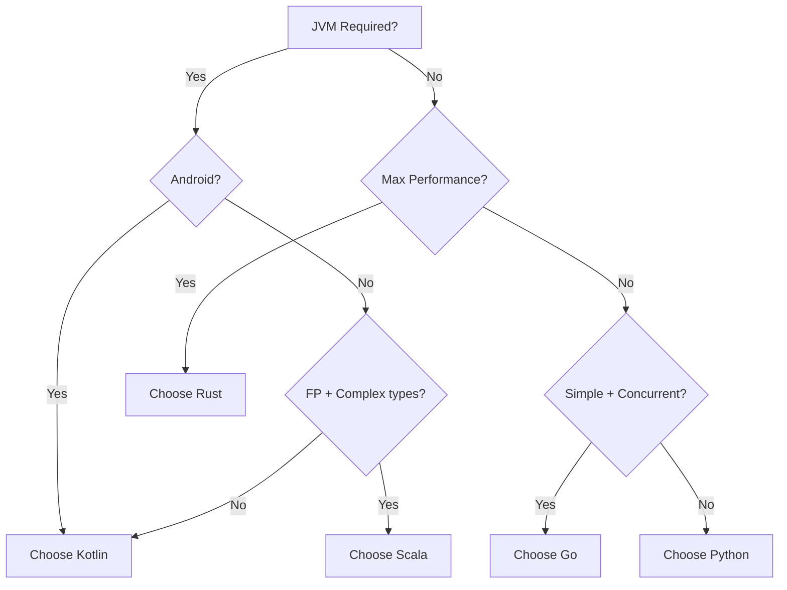

# Why Kotlin, Why Not X


## The Honest Answer

No language is universally better. Kotlin wins in specific contexts. It loses in others. This guide covers the trade-offs.

## Kotlin vs Java

**Choose Kotlin when:**
- You want null safety enforced by the compiler, not by convention
- You want concise code (data classes, expression bodies, smart casts)
- You want coroutines with structured cancellation and Flow for streaming
- You want to share code between backend and mobile via Kotlin Multiplatform

**Choose Java when:**
- Your team has deep Spring Boot expertise and no bandwidth to switch
- You need virtual threads (Java 21+) for a lift-and-shift of blocking code
- Your organization mandates Java for compliance or hiring reasons

Kotlin compiles to the same JVM bytecode. You keep all Java libraries. The switch is low-risk. You can write one file in Kotlin and the rest in Java. They interoperate with zero overhead.

The code difference is real:

```kotlin
// Kotlin: 1 line
data class User(val id: String, val name: String, val email: String)
```

```java
// Java: 30+ lines (constructor, getters, equals, hashCode, toString)
public class User {
    private final String id;
    private final String name;
    private final String email;
    // ... 25 more lines
}
```

## Kotlin vs Go

**Choose Kotlin when:**
- You need the JVM ecosystem (specific Java libraries for your domain)
- You want Kotlin Multiplatform sharing between backend and mobile
- You want a richer type system (sealed classes, nullable types, generics)
- You want coroutine-based streaming (Flow) as a first-class primitive

**Choose Go when:**
- You want the simplest possible deployment model (single static binary)
- You want instant cold starts (no JVM warm-up)
- Your team has no JVM experience and wants a minimal runtime
- You are building infrastructure tooling where a single binary matters

Go is simpler. Kotlin is more expressive. Simplicity wins for small teams and infrastructure. Expressiveness wins for complex domain logic.

## Kotlin vs Swift

Both are modern languages with similar syntax (both influenced by Kotlin's design conversations with Apple). The choice is determined by platform, not language quality.

- **Kotlin** for backend (JVM), Android, and cross-platform business logic.
- **Swift** for iOS, macOS, and Apple platform native development.

If you share business logic between iOS and backend, use Kotlin Multiplatform for the shared module and Swift for the iOS UI.

## Kotlin vs Scala

**Choose Kotlin when:**
- You want gradual adoption (Kotlin interoperates with Java seamlessly)
- You want a language your Java team can learn in days, not months
- You want straightforward tooling (IntelliJ support is first-class)

**Choose Scala when:**
- You need advanced type system features (higher-kinded types, implicits)
- You are building data pipelines with Apache Spark (Scala is the native language)
- Your team has functional programming expertise and wants the full FP toolkit

Scala is more powerful. Kotlin is more pragmatic. Most backend teams should choose pragmatism.

## Kotlin vs Rust

These serve different purposes.

**Choose Kotlin when:**
- You are building standard backend services, APIs, microservices
- You want fast development with garbage collection
- You want the JVM ecosystem

**Choose Rust when:**
- You need sub-millisecond latency guarantees
- You need memory safety without garbage collection pauses
- You are building systems software, parsers, or high-performance infrastructure

## The Decision Framework



```
Do you need the JVM ecosystem?          -> Kotlin
Do you need instant cold starts?         -> Go or GraalVM native Kotlin
Do you need shared mobile logic?         -> Kotlin Multiplatform
Do you need Spark/data pipelines?        -> Scala
Do you need systems-level performance?   -> Rust
Is your team all-in on Spring Boot?      -> Java (or Kotlin with Spring)
```

## Key Takeaways

- Kotlin wins when you want JVM libraries, null safety, and concise syntax.
- Go wins for deployment simplicity and cold starts.
- Rust wins for raw performance.
- Scala wins for advanced type systems and Spark.
- Choose based on your team, your ecosystem, and your problem. Not on language hype.
