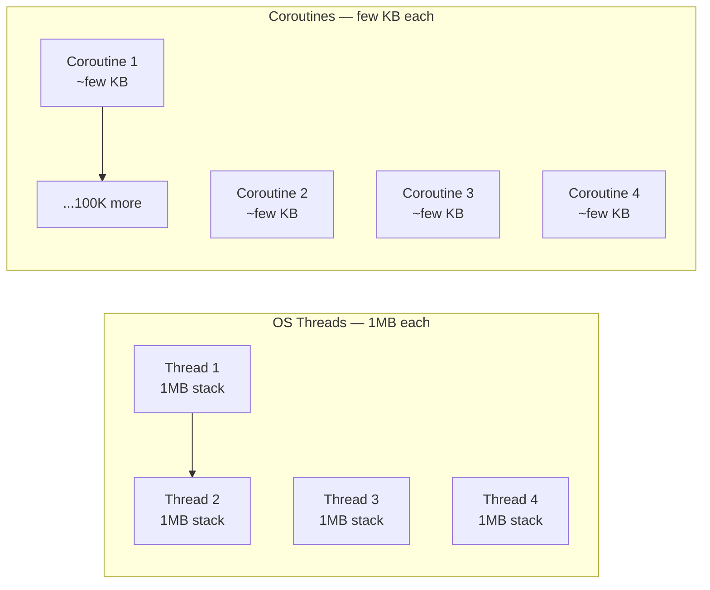
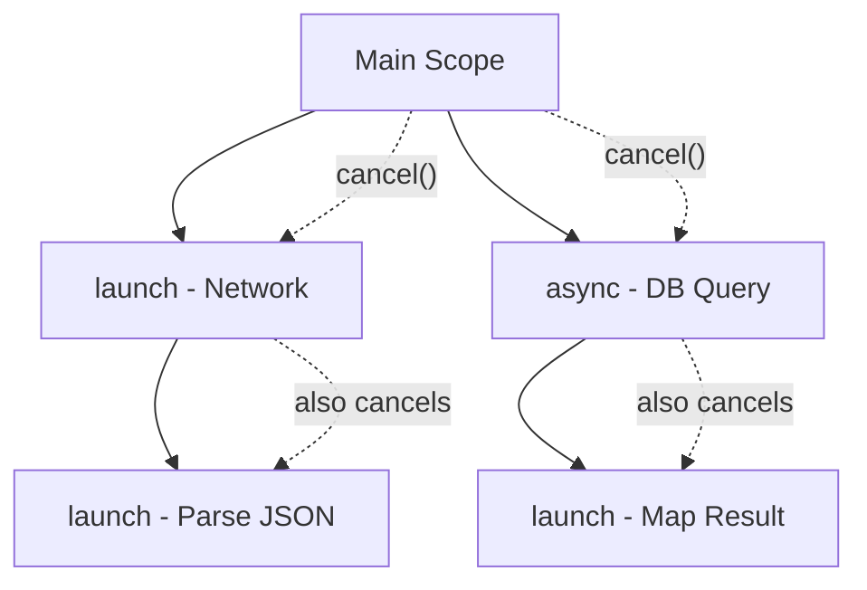

# Coroutines


## Why Coroutines

A thread costs 1-2 MB of stack memory. 10,000 threads consume 10+ GB. 10,000 coroutines consume a few MB. Coroutines are lightweight because they suspend (pause) without blocking a thread.



Coroutines are not threads. They are not JavaScript Promises. They are a language-level construct for suspendable computation. The Kotlin compiler transforms suspend functions into state machines.

## suspend Functions

A function marked `suspend` can pause without blocking a thread. It can only be called from a coroutine or another suspend function.

```kotlin
suspend fun fetchUser(id: String): User {
    val response = httpClient.get("https://api.example.com/users/$id")
    return response.body<User>()
}
```

When `httpClient.get` waits for the network response, the coroutine suspends. The thread is free to do other work. When the response arrives, the coroutine resumes on the thread pool.

This is the fundamental building block. Every asynchronous operation in Kotlin is a suspend function.

## coroutineScope

Creates a new coroutine scope. All child coroutines must complete before the scope returns. If any child fails, the parent is cancelled.

```kotlin
suspend fun loadDashboard(userId: String): Dashboard = coroutineScope {
    val user = async { fetchUser(userId) }
    val orders = async { fetchOrders(userId) }
    val recommendations = async { fetchRecommendations(userId) }

    Dashboard(
        user = user.await(),
        orders = orders.await(),
        recommendations = recommendations.await()
    )
}
```

Step by step:

1. `coroutineScope` creates a new scope.
2. `async` launches three child coroutines concurrently.
3. Each child runs `fetchUser`, `fetchOrders`, `fetchRecommendations` in parallel.
4. `await()` suspends until each result is ready.
5. If any child fails, the other two are cancelled automatically.

This is **structured concurrency**: every coroutine has a parent, lifecycle is bounded, errors propagate.

## async and launch

- `async` -- starts a coroutine that produces a result. Call `.await()` to get it.
- `launch` -- starts a coroutine that does not produce a result (fire-and-forget with structure).

```kotlin
suspend fun processOrder(order: Order) = coroutineScope {
    launch { sendConfirmationEmail(order) }
    launch { updateInventory(order) }
    val receipt = async { generateReceipt(order) }
    receipt.await()
}
```

## Dispatchers

Dispatchers determine which thread pool a coroutine runs on.

| Dispatcher | Use Case |
|------------|----------|
| `Dispatchers.Default` | CPU-bound work (sorting, parsing, computation) |
| `Dispatchers.IO` | I/O-bound work (network, file, database, blocking calls) |
| `Dispatchers.Main` | UI thread (Android, not backend) |

Switch dispatchers with `withContext`:

```kotlin
suspend fun getUser(id: String): User = withContext(Dispatchers.IO) {
    database.findById(id)  // Blocking JDBC call runs on IO pool
    }
}
```

Never run blocking I/O on `Dispatchers.Default`. It starves the CPU-bound pool. Always wrap blocking calls with `withContext(Dispatchers.IO)`.

## Structured Concurrency Rules



1. A parent waits for all children to complete.
2. If a child fails, the parent is cancelled.
3. If the parent is cancelled, all children are cancelled.
4. Never use `GlobalScope` (it lives forever, defeats structure).

## supervisorScope

Like `coroutineScope`, but children fail independently. One child failure does not cancel siblings.

```kotlin
suspend fun processBatch(items: List<Item>) = supervisorScope {
    items.forEach { item ->
        launch {
            processItem(item)  // If this fails, other items continue
        }
    }
}
```

Use `coroutineScope` when children must all succeed together. Use `supervisorScope` when children are independent.

## Cancellation

Coroutines are cancellable. `delay()` and most suspend functions check for cancellation automatically. For CPU-bound loops, call `ensureActive()`:

```kotlin
suspend fun processLargeList(items: List<Item>): List<Result> {
    return items.map { item ->
        ensureActive()
        expensiveComputation(item)
    }
}
```

Never swallow `CancellationException`. If you catch an exception, re-throw it:

```kotlin
try {
    riskyOperation()
} catch (e: CancellationException) {
    throw e  // Always re-throw
} catch (e: Exception) {
    handle(e)
}
```

## Key Takeaways

- Coroutines are lightweight threads. They suspend without blocking.
- Mark async functions with `suspend`. Call them from coroutines only.
- Use `coroutineScope` for structured concurrency. Never `GlobalScope`.
- Use `Dispatchers.IO` for blocking calls. Use `Dispatchers.Default` for CPU work.
- `async` returns a result. `launch` is fire-and-forget.
- `supervisorScope` for independent children. `coroutineScope` for dependent children.
