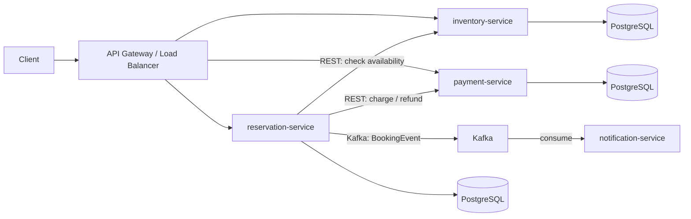

# Workshop Project: Booking Management System

**Roadmap:** Kotlin Backend (Ktor)
**Challenge Repo:** https://github.com/TP-Coder-Innovation-Hub/booking-management-system-challenge
**Business Domain:** Travel & Hospitality Booking

---

## Business Context

Build a booking management system for a travel/hospitality platform. Hotels list rooms with available time slots. Guests search for availability, book rooms, pay, and receive notifications. Pricing adjusts based on season and day of week. The system must prevent double-booking and handle payments idempotently.

Core entities: hotels, rooms, time slots, bookings, payments, notifications.

---

## Learning Objectives

- Structure a multi-service Kotlin backend using Ktor
- Use Kotlin coroutines and `kotlinx.coroutines` channels for async operations
- Define REST APIs with Ktor routing and middleware
- Persist data with Exposed or Ktorm ORM against PostgreSQL
- Wire dependencies with Koin
- Serialize/deserialize JSON with Kotlin serialization
- Produce and consume Kafka events for async inter-service communication
- Write automated tests for services and integration points

---

## Architecture



**Communication:**
- **Sync:** REST between services (reservation checks inventory; reservation initiates payment)
- **Async:** Kafka for booking events consumed by notification-service

---

## Services

| Service | Responsibility | Database |
|---|---|---|
| `inventory-service` | Hotels, rooms, time slots, availability tracking | PostgreSQL |
| `reservation-service` | Booking, conflict detection, pricing rules, confirmation/cancellation | PostgreSQL |
| `payment-service` | Mock payment gateway, refunds, idempotency keys | PostgreSQL |
| `notification-service` | Booking confirmations, reminders, cancellation notices | PostgreSQL (dedup log) |

---

## Feature Requirements

### 1. Resource Inventory

> `inventory-service`

**Endpoints:**

| Method | Path | Description |
|---|---|---|
| GET | `/hotels` | List hotels |
| GET | `/hotels/{id}/rooms` | List rooms for a hotel |
| GET | `/rooms/{id}/slots?from=&to=` | List available time slots in date range |
| PATCH | `/slots/{id}/status` | Mark slot available / held / booked |

**Acceptance Criteria:**

- Returns paginated hotel and room listings
- Slot availability query returns only slots where `status = AVAILABLE` within the requested date range
- Slot status changes are atomic — concurrent hold requests for the same slot are serialized
- Responds 404 for non-existent hotel/room/slot IDs

---

### 2. Booking with Conflict Detection

> `reservation-service`

**Endpoints:**

| Method | Path | Description |
|---|---|---|
| POST | `/bookings` | Create a booking |
| GET | `/bookings/{id}` | Get booking details |
| POST | `/bookings/{id}/cancel` | Cancel a booking |

**Booking creation flow:**

1. Receive `{ roomId, checkIn, checkOut, guestId }`
2. Call `inventory-service` to verify all slots in the range are `AVAILABLE`
3. If available, hold slots (optimistic lock or compare-and-swap on slot version)
4. Call `payment-service` to charge
5. If payment succeeds, confirm booking and mark slots `BOOKED`
6. If payment fails, release slots back to `AVAILABLE`
7. Publish `BookingConfirmed` or `BookingFailed` event to Kafka

**Acceptance Criteria:**

- Two concurrent booking requests for the same room/dates cannot both succeed
- A booking in a conflicting date range is rejected with 409 Conflict
- Cancellation marks slots `AVAILABLE` and triggers a refund via `payment-service`
- All state transitions are logged with timestamps

---

### 3. Pricing Rules

> `reservation-service`

**Logic:**

- **Seasonal rates:** configurable date ranges with a multiplier (e.g., summer 1.4x, off-season 0.8x)
- **Weekend rates:** configurable weekend multiplier applied on top (e.g., 1.2x for Fri-Sun)
- **Base price:** stored per room per night in `inventory-service`

**Pricing calculation:**

```
final_price = sum(each night: base_price x seasonal_multiplier x weekend_multiplier)
```

**Acceptance Criteria:**

- Seasonal and weekend rules are configurable via seed data or admin endpoint
- Booking response includes an itemized price breakdown (per-night)
- Price is locked at booking creation time — later rule changes do not affect existing bookings

---

### 4. Payment Processing

> `payment-service`

**Endpoints:**

| Method | Path | Description |
|---|---|---|
| POST | `/charges` | Charge a payment |
| POST | `/refunds` | Refund a payment |
| GET | `/charges/{id}` | Get charge status |

**Rules:**

- Mock gateway — always succeeds unless `amount > 10000` (simulated decline)
- Idempotency: duplicate charge requests with the same `idempotencyKey` return the original result
- Refunds reference the original charge ID

**Acceptance Criteria:**

- Same `idempotencyKey` never creates a duplicate charge
- Declined charges return 402 with a clear error body
- Refund amount cannot exceed the original charge amount
- Charge and refund history is queryable

---

### 5. Notifications

> `notification-service`

**Consumes Kafka events:**

| Event | Action |
|---|---|
| `BookingConfirmed` | Send confirmation notification |
| `BookingCancelled` | Send cancellation notification |
| `BookingReminder` (scheduled) | Send reminder notification |

**Notification channels (mock):** Log to stdout with structured JSON. Pluggable interface for future email/SMS.

**Acceptance Criteria:**

- Consumes events from Kafka with at-least-once semantics
- Deduplicates notifications using a persisted event ID log
- Each notification record includes: booking ID, guest ID, event type, timestamp, channel

---

## Tech Constraints

| Constraint | Requirement |
|---|---|
| Language | Kotlin (JVM) |
| Framework | Ktor |
| Async | Kotlin coroutines, `kotlinx.coroutines` channels for internal async |
| ORM | Exposed or Ktorm |
| DI | Koin |
| Serialization | Kotlin serialization (`kotlinx.serialization`) |
| Database | PostgreSQL per service |
| Message broker | Apache Kafka |
| Testing | JUnit 5, kotlinx-coroutines-test, Ktor test engine |
| Build | Gradle (Kotlin DSL) |
| Docker | Docker Compose for local dev (PostgreSQL, Kafka, services) |

---

## Architecture Decision Records

### ADR-1: Exposed as ORM

**Context:** Need a Kotlin-idiomatic way to interact with PostgreSQL.
**Decision:** Use Exposed (JetBrains) over Ktorm or raw JDBC.
**Consequences:** Type-safe SQL DSL, strong Kotlin integration, smaller community than Hibernate but aligns with Kotlin-first approach.

### ADR-2: Koin for Dependency Injection

**Context:** Need a DI framework compatible with Ktor and coroutines.
**Decision:** Use Koin (compile-time safety via annotations optional).
**Consequences:** Lightweight, no code generation, native coroutine support. Not compile-time verified unless using Koin Annotations.

### ADR-3: Kafka for Async Booking Events

**Context:** Notification-service must react to booking lifecycle events without synchronous coupling.
**Decision:** Publish booking events to Kafka; notification-service consumes them.
**Consequences:** Decoupled, replayable, at-least-once delivery requires deduplication in the consumer.

### ADR-4: Optimistic Locking for Slot Availability

**Context:** Concurrent bookings may race for the same room slots.
**Decision:** Use a `version` column on slots — compare-and-swap on hold/confirm. Reject on version mismatch.
**Consequences:** No distributed lock needed. Caller must retry on conflict. Simple and correct for the expected load.

### ADR-5: REST for Synchronous Inter-Service Calls

**Context:** Reservation-service needs real-time inventory checks and payment initiation.
**Decision:** Direct REST calls between services (no service mesh).
**Consequences:** Simple to implement. For production, would need circuit breakers and retries (out of scope for this capstone).

---

## Submission Checklist

- [ ] All four services build with `./gradlew build`
- [ ] Docker Compose starts all services, PostgreSQL instances, and Kafka
- [ ] API endpoints return correct HTTP status codes (200, 201, 404, 409)
- [ ] Concurrent booking conflict detection works (demonstrate with a test)
- [ ] Pricing calculation produces correct totals with seasonal and weekend multipliers
- [ ] Payment idempotency verified — duplicate requests return cached result
- [ ] Notification-service logs at least one notification for each event type
- [ ] Unit tests for pricing rules and conflict detection
- [ ] Integration tests for booking flow (inventory check → book → pay → notify)
- [ ] Kotlin coroutines used for all async I/O (no blocking calls on dispatcher threads)
- [ ] Koin modules configured per service with clear dependency graph
- [ ] Kotlin serialization used for all JSON request/response types
- [ ] No hardcoded credentials — use environment variables
