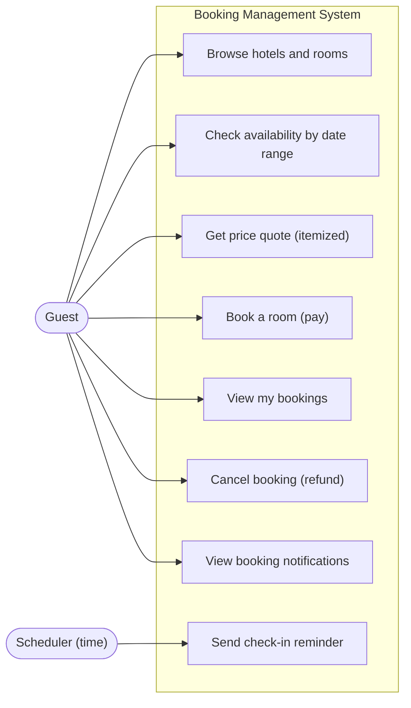
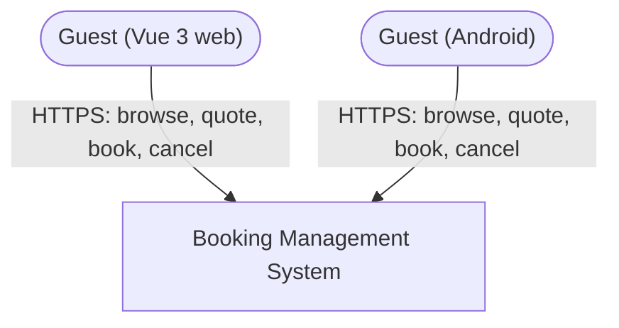
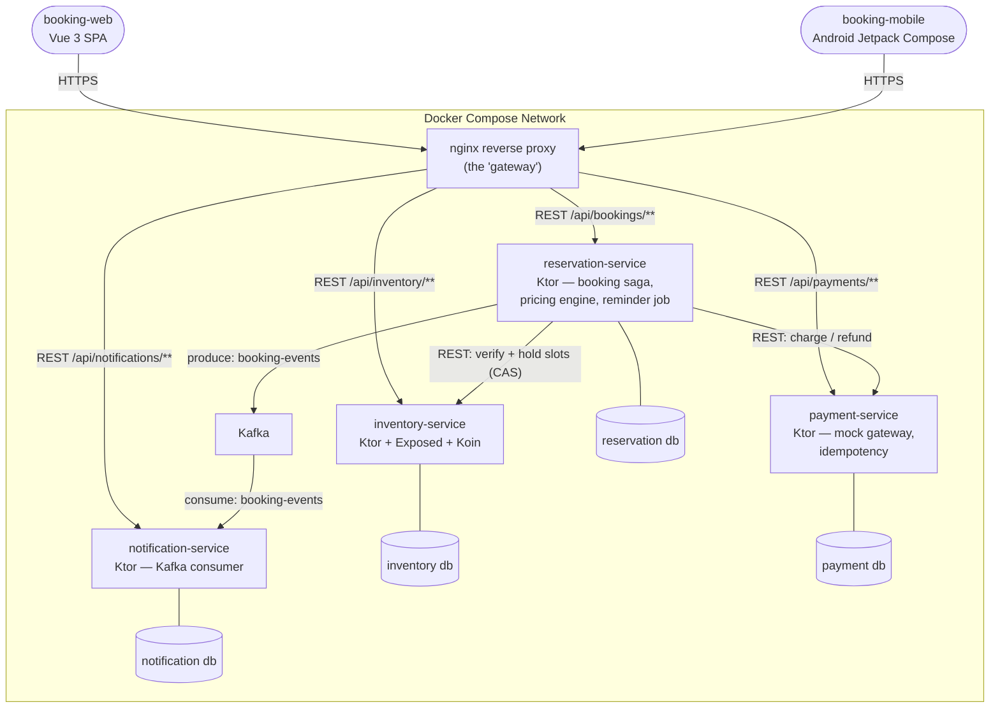
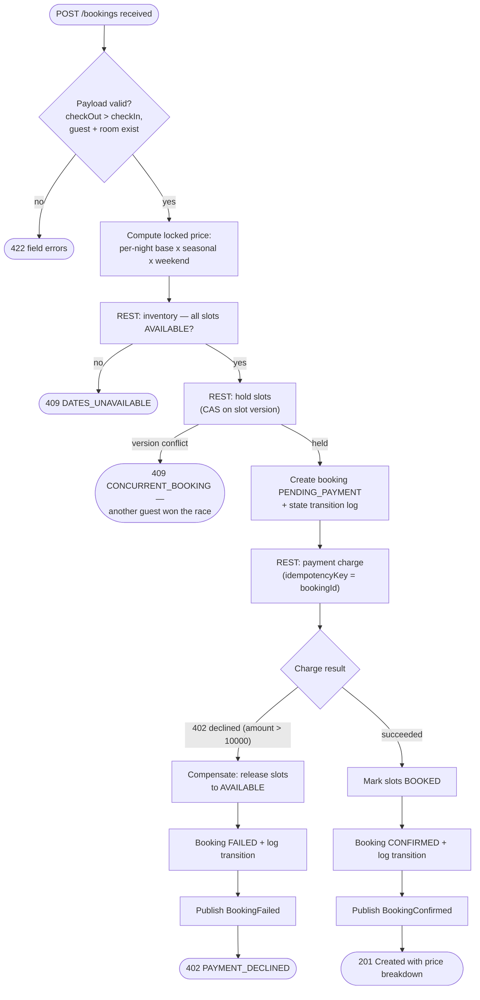
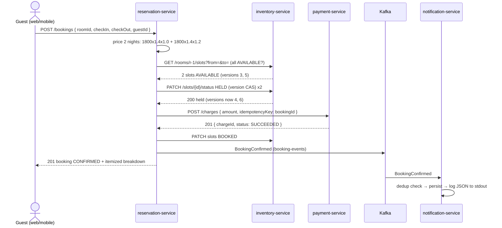
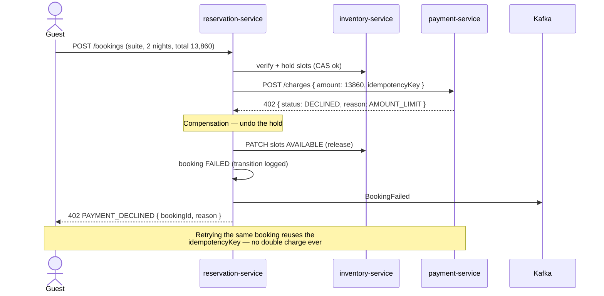
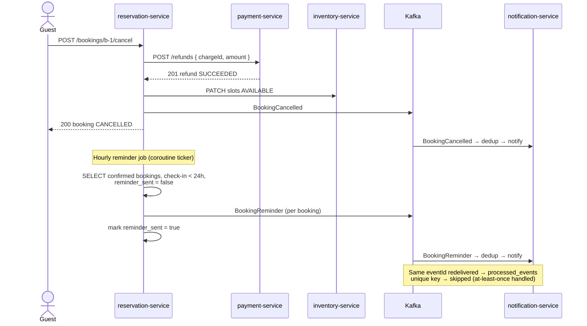

# Capstone Design: Booking Management System

> Companion to [01-capstone-spec.md](./01-capstone-spec.md). Diagrams, contracts, schemas — code organization is yours.

## Design Notes (read first)

1. **Guest identity is a seeded record, not an auth system.** The spec passes `guestId` but defines no users or login. Guests live in a table in reservation-service; clients send `X-Guest-Id`. Auth is not a learning objective here — the saga is. Note the simplification in your README.
2. **Quote before booking.** The spec locks an itemized price at creation, but a booking UI must show the price *before* the guest commits. This design adds `GET /bookings/quote` — same pricing engine, no side effects. The lock-at-creation rule is unchanged: the quote is informational, the booking response is the contract.
3. **`BookingReminder` gets a producer.** The spec lists it as "(scheduled)" with no owner. Design: a coroutine-based scheduled job in reservation-service (e.g., hourly) publishes `BookingReminder` for confirmed bookings checking in within 24 h, marking each booking `reminder_sent` so the job is idempotent.
4. **The "gateway" is an nginx reverse proxy in Compose** (`/api/inventory/* → inventory`, `/api/bookings/* → reservation`, `/api/payments/* → payment`). Building a real gateway is the Spring Cloud capstone's job, not this one.
5. **Notifications get one read endpoint.** Channels are stdout (per spec), but both frontends want a "booking updates" view, and the records are already persisted. `GET /notifications?guestId=` is the only addition.

---

## Part 1: High-Level Design

### 1.1 Use-Case Diagram



### 1.2 System Context Diagram



The payment gateway is *mocked inside* payment-service (always succeeds unless amount > 10,000), so there is no external payment entity — a deliberate spec choice that keeps the saga teachable without PCI concerns.

### 1.3 Container Diagram



All service I/O is coroutine-based (Ktor client for inter-service REST, suspending Kafka producer/consumer wrappers); internal hand-offs like the reminder job use `kotlinx.coroutines` channels.

### 1.4 Activity Diagram — Booking Saga (primary business process)



### 1.5 Sequence Diagrams

#### 1.5.1 Happy path — book and pay



#### 1.5.2 Error path — payment declined, saga compensates



#### 1.5.3 Async path — cancellation, refund, reminder



---

## Part 2: Frontend Design

### 2.1 Frontend Justification

Both frontends serve the **Guest** — travel booking is researched on desktop and booked/managed on phones, so the assignment (Vue 3 site + Android app) mirrors real OTA products. Same API, same flows; the Android app additionally surfaces reminder notifications naturally. There is no admin UI: pricing rules and inventory are seed data by spec.

### 2.2 Route Map (Vue 3) and Screen Map (Android)

**Vue 3 — booking-web**

| Route | Name | Purpose |
|---|---|---|
| `/` | HotelSearch | Hotel list with city filter; date-range picker carried through the funnel |
| `/hotels/:id` | HotelDetail | Rooms with base prices; availability per selected dates |
| `/rooms/:id` | RoomBooking | Calendar of slot availability; live quote (itemized per-night breakdown) as dates change |
| `/checkout` | BookingConfirm | Quote summary → confirm → handles 201 / 402 / 409 outcomes |
| `/bookings` | MyBookings | Guest's bookings by status; cancel action |
| `/bookings/:id` | BookingDetail | Breakdown, state-transition timeline, refund status, notifications |
| `/guest` | GuestSelect | Dev-mode identity picker (`X-Guest-Id`) |
| `/:pathMatch(.*)*` | NotFound | 404 |

Pinia stores: `guest`, `search` (dates, city), `booking` (in-flight quote + checkout state).

**Android — booking-mobile**

| Screen | Purpose |
|---|---|
| `GuestSelectScreen` | Dev-mode identity |
| `HotelListScreen` | Search + city filter; hotel cards (Coil images) |
| `HotelDetailScreen` | Rooms, base price, "select dates" |
| `RoomBookingScreen` | DateRangePicker; quote breakdown refreshes on date change |
| `CheckoutScreen` | Confirm → success / declined / conflict states |
| `MyBookingsScreen` | Tabs by status; pull-to-refresh |
| `BookingDetailScreen` | Breakdown + timeline + cancel with confirmation dialog |

### 2.3 Key UI Interactions

| Interaction | Behavior |
|---|---|
| Live quote | Date change → debounced `GET /bookings/quote`; render per-night rows (base × seasonal × weekend) so the multiplier logic is *visible* — this is the pricing feature's demo |
| Booking outcomes | `201` → confirmation screen; `402 PAYMENT_DECLINED` → explain and keep dates; `409 CONCURRENT_BOOKING` / `DATES_UNAVAILABLE` → refresh calendar, prompt new dates. All three must be reachable from seed data |
| Double-submit guard | Disable confirm button on tap; safe regardless thanks to the idempotency key, but the UI shouldn't depend on it |
| Cancel flow | Confirmation dialog shows refund amount; detail view then shows `CANCELLED` + refund status from payment history |
| State timeline | BookingDetail renders the transition log (PENDING_PAYMENT → CONFIRMED → CANCELLED with timestamps) — makes the saga observable |
| Availability calendar | Slots rendered AVAILABLE / HELD / BOOKED; HELD shown as unavailable (another guest's in-flight saga) |

---

## Part 3: API Contracts

Identity: `X-Guest-Id: <uuid>` (Design Note 1). Errors: `{ "status": 409, "errorCode": "CONCURRENT_BOOKING", "message": "..." }`. Amounts: THB, string decimal, 2 dp.

### inventory-service

| | |
|---|---|
| `GET /hotels?city=&page=0&size=20` | 200 `{ "content": [ { "id": uuid, "name": string, "city": string, "imageUrl": string } ], ...pagination }` |
| `GET /hotels/{id}/rooms?page=0&size=20` | 200 `{ "content": [ { "id": uuid, "hotelId": uuid, "name": string, "capacity": number, "basePricePerNight": "1800.00", "imageUrl": string } ], ... }` · `404 HOTEL_NOT_FOUND` |
| `GET /rooms/{id}/slots?from=2026-07-01&to=2026-07-05` | 200 `[ { "id": uuid, "roomId": uuid, "date": date, "status": "AVAILABLE" \| "HELD" \| "BOOKED", "version": number } ]` · `404`, `422 INVALID_RANGE` |
| `PATCH /slots/{id}/status` — `{ "status": "HELD" \| "BOOKED" \| "AVAILABLE", "expectedVersion": number, "bookingId": uuid }` | 200 `{ "id", "status", "version" }` — CAS: `409 VERSION_CONFLICT` if `expectedVersion` stale (ADR-4) · `404` · `422 INVALID_TRANSITION` (e.g., BOOKED → HELD) |

### reservation-service

| | |
|---|---|
| `GET /bookings/quote?roomId=&checkIn=&checkOut=` | 200 `{ "roomId": uuid, "checkIn": date, "checkOut": date, "nights": [ { "date": date, "basePrice": "1800.00", "seasonalMultiplier": 1.4, "weekendMultiplier": 1.2, "nightTotal": "3024.00" } ], "total": "5544.00" }` — pure calculation, no holds · `404`, `422` |
| `POST /bookings` — `{ "roomId": uuid, "checkIn": date, "checkOut": date, "guestId": uuid }` | 201 `Booking` · `409 DATES_UNAVAILABLE` \| `409 CONCURRENT_BOOKING` · `402 PAYMENT_DECLINED` (+ failed `bookingId` for the audit trail) · `422` · `503 INVENTORY_UNAVAILABLE` \| `503 PAYMENT_UNAVAILABLE` |
| `GET /bookings/{id}` | 200 `Booking` · `404` |
| `GET /bookings?guestId=&status=&page=0&size=20` | 200 paginated bookings (guest's own) |
| `POST /bookings/{id}/cancel` | 200 `Booking` (CANCELLED; refund issued; slots released) · `422 ALREADY_CANCELLED` \| `422 NOT_CANCELLABLE` (FAILED bookings) · `404` |

`Booking`: `{ "id": uuid, "guestId": uuid, "roomId": uuid, "hotelName": string, "roomName": string, "checkIn": date, "checkOut": date, "status": "PENDING_PAYMENT" | "CONFIRMED" | "FAILED" | "CANCELLED", "priceBreakdown": <quote shape>, "total": "5544.00", "chargeId": uuid | null, "transitions": [ { "from": string | null, "to": string, "at": iso8601 } ], "createdAt": iso8601 }`

### payment-service

| | |
|---|---|
| `POST /charges` — `{ "amount": "5544.00", "currency": "THB", "idempotencyKey": string, "guestId": uuid, "bookingId": uuid }` | 201 `{ "chargeId": uuid, "status": "SUCCEEDED", "amount", "replayed": false }` — same `idempotencyKey` → 200 original result, `replayed: true` · `402 { "status": "DECLINED", "reason": "AMOUNT_LIMIT" }` (amount > 10000) · `422` |
| `POST /refunds` — `{ "chargeId": uuid, "amount": "5544.00", "reason": string }` | 201 `{ "refundId": uuid, "chargeId": uuid, "status": "SUCCEEDED" }` · `422 EXCEEDS_CHARGE_AMOUNT` (cumulative refunds > original) · `404 CHARGE_NOT_FOUND` |
| `GET /charges/{id}` | 200 `{ "chargeId", "status", "amount", "refunds": [Refund], "createdAt" }` · `404` |

### notification-service

| | |
|---|---|
| `GET /notifications?guestId=&type=&page=0&size=20` | 200 `{ "content": [ { "id": uuid, "bookingId": uuid, "guestId": uuid, "eventType": "BookingConfirmed" \| "BookingCancelled" \| "BookingReminder" \| "BookingFailed", "channel": "STDOUT", "createdAt": iso8601 } ], ... }` |

---

## Part 4: Database Schema

One PostgreSQL per service (Exposed table objects map 1:1 to these).

### inventory db

```sql
CREATE TABLE hotels (
    id        UUID PRIMARY KEY DEFAULT gen_random_uuid(),
    name      VARCHAR(128) NOT NULL,
    city      VARCHAR(64)  NOT NULL,
    image_url VARCHAR(512)
);
CREATE INDEX idx_hotels_city ON hotels (city);

CREATE TABLE rooms (
    id                   UUID PRIMARY KEY DEFAULT gen_random_uuid(),
    hotel_id             UUID NOT NULL REFERENCES hotels(id),
    name                 VARCHAR(64)   NOT NULL,
    capacity             INT           NOT NULL CHECK (capacity > 0),
    base_price_per_night NUMERIC(10,2) NOT NULL CHECK (base_price_per_night > 0),
    image_url            VARCHAR(512)
);
CREATE INDEX idx_rooms_hotel ON rooms (hotel_id);

-- One slot per room per night. The version column is the whole concurrency story
-- (ADR-4): hold/confirm is UPDATE ... WHERE id = ? AND version = ? — 0 rows = lost race.
CREATE TABLE slots (
    id         UUID PRIMARY KEY DEFAULT gen_random_uuid(),
    room_id    UUID        NOT NULL REFERENCES rooms(id),
    date       DATE        NOT NULL,
    status     VARCHAR(12) NOT NULL DEFAULT 'AVAILABLE' CHECK (status IN ('AVAILABLE','HELD','BOOKED')),
    booking_id UUID,                       -- which booking holds/booked it (release targeting)
    version    BIGINT      NOT NULL DEFAULT 0,
    UNIQUE (room_id, date)
);
CREATE INDEX idx_slots_room_date ON slots (room_id, date) WHERE status = 'AVAILABLE';
```

### reservation db

```sql
CREATE TABLE guests (
    id    UUID PRIMARY KEY DEFAULT gen_random_uuid(),
    name  VARCHAR(128) NOT NULL,
    email VARCHAR(255) NOT NULL UNIQUE
);

CREATE TABLE pricing_rules (
    id         UUID PRIMARY KEY DEFAULT gen_random_uuid(),
    rule_type  VARCHAR(12)  NOT NULL CHECK (rule_type IN ('SEASONAL','WEEKEND')),
    name       VARCHAR(64)  NOT NULL,
    date_from  DATE,                      -- SEASONAL only
    date_to    DATE,                      -- SEASONAL only
    days       VARCHAR(32),               -- WEEKEND only, e.g. 'FRI,SAT,SUN'
    multiplier NUMERIC(4,2) NOT NULL CHECK (multiplier > 0)
);

CREATE TABLE bookings (
    id              UUID PRIMARY KEY DEFAULT gen_random_uuid(),
    guest_id        UUID NOT NULL REFERENCES guests(id),
    room_id         UUID NOT NULL,        -- inventory id; no cross-service FK
    hotel_name      VARCHAR(128) NOT NULL,  -- denormalized snapshot at booking time
    room_name       VARCHAR(64)  NOT NULL,
    check_in        DATE NOT NULL,
    check_out       DATE NOT NULL,
    status          VARCHAR(16) NOT NULL CHECK (status IN ('PENDING_PAYMENT','CONFIRMED','FAILED','CANCELLED')),
    price_breakdown JSONB NOT NULL,       -- locked at creation (F3) — rule changes never touch it
    total           NUMERIC(10,2) NOT NULL,
    charge_id       UUID,
    reminder_sent   BOOLEAN NOT NULL DEFAULT false,   -- reminder job idempotence (Design Note 3)
    created_at      TIMESTAMPTZ NOT NULL DEFAULT now(),
    CHECK (check_out > check_in)
);
CREATE INDEX idx_bookings_guest ON bookings (guest_id, created_at DESC);
CREATE INDEX idx_bookings_reminder ON bookings (check_in) WHERE status = 'CONFIRMED' AND NOT reminder_sent;

CREATE TABLE booking_transitions (        -- "all state transitions logged with timestamps"
    id          BIGSERIAL PRIMARY KEY,
    booking_id  UUID NOT NULL REFERENCES bookings(id),
    from_status VARCHAR(16),
    to_status   VARCHAR(16) NOT NULL,
    detail      VARCHAR(255),
    created_at  TIMESTAMPTZ NOT NULL DEFAULT now()
);
CREATE INDEX idx_transitions_booking ON booking_transitions (booking_id, created_at);

CREATE TABLE outbox_events (              -- event published atomically with the state change
    event_id     UUID PRIMARY KEY DEFAULT gen_random_uuid(),
    aggregate_id UUID NOT NULL,
    event_type   VARCHAR(32) NOT NULL,
    payload      JSONB NOT NULL,
    published    BOOLEAN NOT NULL DEFAULT false,
    created_at   TIMESTAMPTZ NOT NULL DEFAULT now()
);
CREATE INDEX idx_outbox_unpublished ON outbox_events (created_at) WHERE NOT published;
```

### payment db

```sql
CREATE TABLE charges (
    id              UUID PRIMARY KEY DEFAULT gen_random_uuid(),
    idempotency_key VARCHAR(128) NOT NULL UNIQUE,   -- the dedup guard (F4)
    booking_id      UUID NOT NULL,
    guest_id        UUID NOT NULL,
    amount          NUMERIC(10,2) NOT NULL CHECK (amount > 0),
    currency        CHAR(3) NOT NULL DEFAULT 'THB',
    status          VARCHAR(12) NOT NULL CHECK (status IN ('SUCCEEDED','DECLINED')),
    decline_reason  VARCHAR(32),
    created_at      TIMESTAMPTZ NOT NULL DEFAULT now()
);

CREATE TABLE refunds (
    id         UUID PRIMARY KEY DEFAULT gen_random_uuid(),
    charge_id  UUID NOT NULL REFERENCES charges(id),
    amount     NUMERIC(10,2) NOT NULL CHECK (amount > 0),
    reason     VARCHAR(128),
    status     VARCHAR(12) NOT NULL DEFAULT 'SUCCEEDED',
    created_at TIMESTAMPTZ NOT NULL DEFAULT now()
);
-- "refunds cannot exceed charge" = SUM(refunds.amount) <= charge.amount,
-- checked in a transaction (SELECT ... FOR UPDATE on the charge row).
CREATE INDEX idx_refunds_charge ON refunds (charge_id);
```

### notification db

```sql
CREATE TABLE processed_events (
    event_id     UUID PRIMARY KEY,
    processed_at TIMESTAMPTZ NOT NULL DEFAULT now()
);

CREATE TABLE notifications (
    id         UUID PRIMARY KEY DEFAULT gen_random_uuid(),
    event_id   UUID NOT NULL,
    booking_id UUID NOT NULL,
    guest_id   UUID NOT NULL,
    event_type VARCHAR(24) NOT NULL,
    channel    VARCHAR(12) NOT NULL DEFAULT 'STDOUT',  -- pluggable interface (spec F5)
    payload    JSONB NOT NULL,
    created_at TIMESTAMPTZ NOT NULL DEFAULT now()
);
CREATE INDEX idx_notifications_guest ON notifications (guest_id, created_at DESC);
```

---

## Part 5: Event Contracts

Topic: **`booking-events`** · Producer: reservation-service (outbox relay) · Consumer: notification-service (group `notification-group`) · Key: `bookingId` (per-booking ordering) · Delivery: at-least-once; consumer dedups via `processed_events`.

Envelope: `{ "eventId": uuid, "eventType": string, "occurredAt": iso8601, "payload": {} }`

| eventType | Payload | Emitted when |
|---|---|---|
| `BookingConfirmed` | `{ "bookingId", "guestId", "guestEmail", "hotelName", "roomName", "checkIn", "checkOut", "total" }` | Payment succeeded, slots BOOKED |
| `BookingFailed` | `{ "bookingId", "guestId", "reason": "PAYMENT_DECLINED" }` | Saga compensated |
| `BookingCancelled` | `{ "bookingId", "guestId", "guestEmail", "refundAmount" }` | Cancel + refund completed |
| `BookingReminder` | `{ "bookingId", "guestId", "guestEmail", "hotelName", "checkIn" }` | Scheduled job, check-in < 24 h |

Consumer contract: insert `processed_events` first (conflict = skip); render structured-JSON stdout line per notification; persist the record. Serialization: `kotlinx.serialization` data classes shared in a `contracts` module — the event schema is code, version it deliberately.

---

## Part 6: Seed Data

```sql
-- inventory db ------------------------------------------------------------
INSERT INTO hotels (id, name, city, image_url) VALUES
('h0000001-0000-0000-0000-000000000001', 'Chao Phraya Riverside Hotel', 'Bangkok',    'https://img.test/cpr.jpg'),
('h0000001-0000-0000-0000-000000000002', 'Doi Suthep Mountain Lodge',   'Chiang Mai', 'https://img.test/dsl.jpg');

INSERT INTO rooms (id, hotel_id, name, capacity, base_price_per_night, image_url) VALUES
('r0000001-0000-0000-0000-000000000001', 'h0000001-0000-0000-0000-000000000001', 'Standard Twin',   2, 1800.00, 'https://img.test/twin.jpg'),
('r0000001-0000-0000-0000-000000000002', 'h0000001-0000-0000-0000-000000000001', 'River Suite',     4, 5500.00, 'https://img.test/suite.jpg'),
('r0000001-0000-0000-0000-000000000003', 'h0000001-0000-0000-0000-000000000002', 'Mountain Cabin',  2, 2200.00, 'https://img.test/cabin.jpg');
-- River Suite: 2 nights in high season ≈ 5500x1.4x2 = 15,400 > 10,000 → guaranteed
-- payment decline — the saga-compensation scenario is bookable from seed data alone.

-- Slots: next 90 nights per room, AVAILABLE
INSERT INTO slots (room_id, date)
SELECT r.id, CURRENT_DATE + n
FROM rooms r CROSS JOIN generate_series(0, 89) AS n;

-- Pre-book 2 nights on Standard Twin (conflict-detection fixture)
UPDATE slots SET status = 'BOOKED', booking_id = 'b0000001-0000-0000-0000-000000000001', version = version + 1
WHERE room_id = 'r0000001-0000-0000-0000-000000000001'
  AND date IN (CURRENT_DATE + 10, CURRENT_DATE + 11);

-- reservation db ------------------------------------------------------------
INSERT INTO guests (id, name, email) VALUES
('g0000001-0000-0000-0000-000000000001', 'Somchai Jaidee',   'somchai@example.test'),
('g0000001-0000-0000-0000-000000000002', 'Malee Suksai',     'malee@example.test'),
('g0000001-0000-0000-0000-000000000003', 'Prasert Boonmee',  'prasert@example.test');

INSERT INTO pricing_rules (rule_type, name, date_from, date_to, days, multiplier) VALUES
('SEASONAL', 'High season (Nov–Feb)', date_trunc('year', now())::date + interval '10 months',
             date_trunc('year', now())::date + interval '14 months', NULL, 1.40),
('SEASONAL', 'Green season (Jun–Sep)', date_trunc('year', now())::date + interval '5 months',
             date_trunc('year', now())::date + interval '9 months',  NULL, 0.80),
('WEEKEND',  'Weekend uplift', NULL, NULL, 'FRI,SAT,SUN', 1.20);

INSERT INTO bookings (id, guest_id, room_id, hotel_name, room_name, check_in, check_out, status, price_breakdown, total, charge_id, created_at) VALUES
('b0000001-0000-0000-0000-000000000001', 'g0000001-0000-0000-0000-000000000001',
 'r0000001-0000-0000-0000-000000000001', 'Chao Phraya Riverside Hotel', 'Standard Twin',
 CURRENT_DATE + 10, CURRENT_DATE + 12, 'CONFIRMED',
 '{"nights":[{"date":"+10d","basePrice":"1800.00","seasonalMultiplier":1.0,"weekendMultiplier":1.0,"nightTotal":"1800.00"},
             {"date":"+11d","basePrice":"1800.00","seasonalMultiplier":1.0,"weekendMultiplier":1.2,"nightTotal":"2160.00"}]}',
 3960.00, 'ch000001-0000-0000-0000-000000000001', now() - interval '3 days');

INSERT INTO booking_transitions (booking_id, from_status, to_status, detail, created_at) VALUES
('b0000001-0000-0000-0000-000000000001', NULL, 'PENDING_PAYMENT', 'slots held', now() - interval '3 days'),
('b0000001-0000-0000-0000-000000000001', 'PENDING_PAYMENT', 'CONFIRMED', 'charge ch-...0001 succeeded', now() - interval '3 days');

-- payment db ------------------------------------------------------------
INSERT INTO charges (id, idempotency_key, booking_id, guest_id, amount, status) VALUES
('ch000001-0000-0000-0000-000000000001', 'b0000001-0000-0000-0000-000000000001',
 'b0000001-0000-0000-0000-000000000001', 'g0000001-0000-0000-0000-000000000001', 3960.00, 'SUCCEEDED');

-- notification db ------------------------------------------------------------
INSERT INTO processed_events (event_id) VALUES ('e0000001-0000-0000-0000-000000000001');
INSERT INTO notifications (event_id, booking_id, guest_id, event_type, payload, created_at) VALUES
('e0000001-0000-0000-0000-000000000001', 'b0000001-0000-0000-0000-000000000001',
 'g0000001-0000-0000-0000-000000000001', 'BookingConfirmed',
 '{"hotelName":"Chao Phraya Riverside Hotel","total":"3960.00"}', now() - interval '3 days');
```

| Seeded scenario | What it exercises |
|---|---|
| Booked slots +10/+11 on Standard Twin | 409 DATES_UNAVAILABLE; calendar shows BOOKED |
| River Suite price > 10k for 2 nights | 402 decline → saga compensation, slots released |
| Seasonal + weekend rules | Quote breakdown shows both multipliers; green-season discount visible |
| Confirmed booking w/ transitions + charge | MyBookings, detail timeline, cancel → refund flow |
| Booking check-in in 10 days | Becomes the reminder-job fixture as the date approaches (or adjust dates in tests) |
| 3 guests | `X-Guest-Id` identities; guest isolation in `GET /bookings` |
