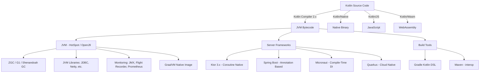
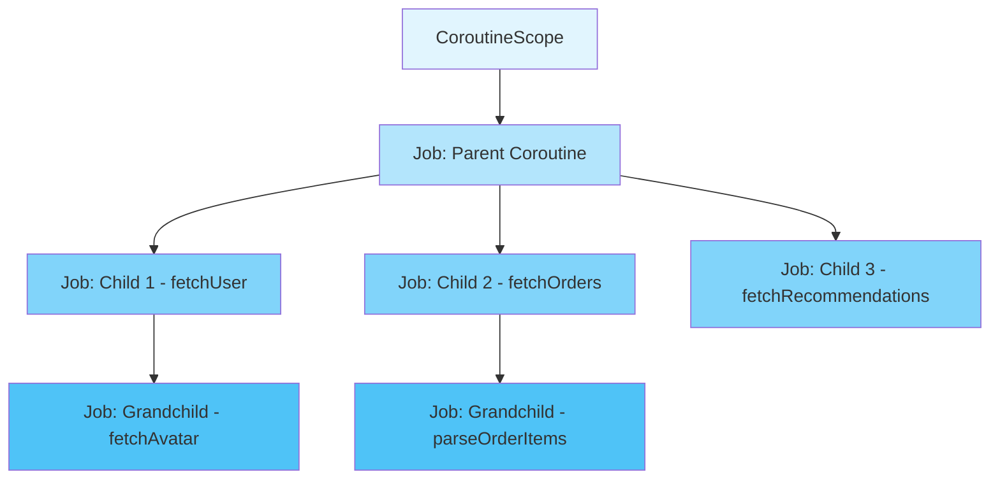
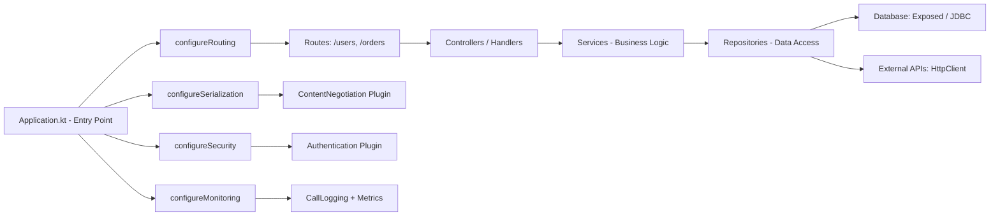

# Kotlin Backend with Ktor Fundamentals

`[Entry]` `[Mid]` `[Senior]`

A practical guide to building backend services with Kotlin and Ktor in 2026. This document covers the language fundamentals, the coroutine concurrency model, the Ktor framework architecture, and the decision framework for choosing Kotlin on the server side.

---

## Table of Contents

1. [Why Kotlin for Backend in 2026](#1-why-kotlin-for-backend-in-2026)
2. [The Kotlin Mental Model for Backend Developers](#2-the-kotlin-mental-model-for-backend-developers)
3. [Coroutines: Structured Concurrency](#3-coroutines-structured-concurrency)
4. [Ktor: A Framework, Not a Container](#4-ktor-a-framework-not-a-container)
5. [Kotlin vs Java for Backend in 2026](#5-kotlin-vs-java-for-backend-in-2026)
6. [Ecosystem and Tooling](#6-ecosystem-and-tooling)
7. [Decision Framework: When Kotlin Backend](#7-decision-framework-when-kotlin-backend)
8. [Common Pitfalls](#8-common-pitfalls)
9. [What's Next](#9-whats-next)

---

## 1. Why Kotlin for Backend in 2026

Kotlin has moved past its "Android language" reputation. In 2026, it is a first-class choice for server-side development, backed by JetBrains, a mature compiler (Kotlin 2.x with the K2 frontend), and a growing ecosystem of server-side libraries.

### The Case for Kotlin on the Backend

**Null safety at the type level.** NullPointerExceptions are the single most common runtime error in Java applications. Kotlin eliminates an entire class of bugs by making nullability explicit in the type system. `String` cannot be null. `String?` can. The compiler enforces this. This alone justifies the switch for many teams.

**Concise syntax without sacrificing readability.** Data classes, expression bodies, string templates, and smart casts reduce boilerplate by 40-60% compared to equivalent Java code. The code you write is the code you read.

**Coroutine-based concurrency.** Kotlin coroutines provide structured, cancellable, composable asynchronous programming without the callback hell of futures or the thread-per-request model. In 2026, coroutines are battle-tested and the standard way to handle I/O-bound work in Kotlin.

**Full JVM ecosystem access.** Kotlin compiles to JVM bytecode. Every Java library ever written works without wrappers. You keep the maturity of the JVM (GC tuning, monitoring tools, deployment infrastructure) while getting a modern language.

**Growing server-side adoption.** JetBrains (the language creator) runs their entire backend on Kotlin. Netflix uses Kotlin for microservices. Cash App (Square/Block) is written almost entirely in Kotlin. Superhuman, Adobe, and Atlassian have adopted Kotlin for backend services. The talent pool is deep and growing.

### Kotlin in 2026: State of the Art

| Aspect | Status |
|--------|--------|
| Language version | Kotlin 2.x (K2 compiler frontend) |
| Server framework | Ktor 3.x (coroutine-native, plugin-based) |
| Serialization | kotlinx.serialization (compiler plugin, no reflection) |
| Database access | Exposed (type-safe SQL DSL) / JetBrains JDBC wrapper |
| Dependency injection | Koin (pragmatic, no code gen) / Kodein |
| Build system | Gradle with Kotlin DSL |
| Multiplatform | Kotlin Multiplatform stable for shared business logic |
| Coroutines | Stable, structured concurrency as default practice |

---

## 2. The Kotlin Mental Model for Backend Developers

### For Java Developers

Kotlin is a better Java. It runs on the same JVM, uses the same libraries, deploys to the same infrastructure. The mental shift is small: less boilerplate, more safety, different syntax for the same concepts. You can call Java from Kotlin and Kotlin from Java with zero overhead. Start with Kotlin on a new service and keep your existing Java services untouched.

### For Developers New to the JVM

Kotlin is a modern language on a mature runtime. You get the benefit of 25+ years of JVM engineering (HotSpot JIT, garbage collectors like ZGC and G1, battle-tested concurrency primitives) without the legacy syntax of Java. The JVM is not slow; it has not been slow for a decade. Warm-up latency is real but manageable with GraalVM native images or CRIU.

### Core Language Concepts for Backend Work

**Null safety.** Types are non-nullable by default. Nullable types are marked with `?`.

```kotlin
fun findUser(id: String): User? {
    return userRepository.findById(id)
}

val user = findUser("123")
println(user.name)         // Compile error: user might be null
println(user?.name)        // Safe call: returns null if user is null
println(user!!.name)       // Force unwrap: throws if null (avoid this)
val name = user?.name ?: "Unknown"  // Elvis operator: default value
```

**Data classes.** One line replaces dozens of lines of Java POJO boilerplate.

```kotlin
data class User(
    val id: String,
    val name: String,
    val email: String
)
// Automatically generates equals(), hashCode(), toString(), copy(), componentN()
```

**Sealed classes.** Restricted class hierarchies that the compiler can exhaustively check. Essential for modeling domain events, results, and states.

```kotlin
sealed class Result<out T> {
    data class Success<T>(val value: T) : Result<T>()
    data class Error(val message: String, val code: Int) : Result<Nothing>()
}

fun handle(result: Result<String>) = when (result) {
    is Result.Success -> println("Got: ${result.value}")
    is Result.Error   -> println("Failed: ${result.message}")
    // No else branch needed: compiler knows all cases are covered
}
```

**Extension functions.** Add methods to existing classes without inheritance.

```kotlin
fun String.isEmail(): Boolean = this.contains("@") && this.contains(".")

fun HttpRequest.validateBody(): ValidationResult {
    // Add validation logic to Ktor's HttpRequest
}
```

### Kotlin's Place in the JVM Ecosystem



`[Entry]` You do not need to understand every node in this diagram. Focus on the path: Kotlin source code compiles to JVM bytecode, which runs on the JVM and can use any Java library. Ktor is one of several framework options built on top.

`[Mid]` Understand that Kotlin compiles to multiple targets. The JVM target is the most mature and is what you use for backend. Kotlin Multiplatform lets you share business logic between backend and mobile clients.

`[Senior]` Evaluate the GraalVM native image path for startup-sensitive deployments (serverless, CLI tools). Consider the tradeoff: faster startup at the cost of constrained reflection and longer build times.

---

## 3. Coroutines: Structured Concurrency

Coroutines are Kotlin's answer to asynchronous programming. They are not threads. They are not JavaScript Promises. They are a language-level construct for suspendable computation that the Kotlin compiler transforms into state machines.

### Why Coroutines, Not Threads

A thread costs 1-2 MB of stack memory by default. 10,000 threads = 10+ GB of memory. 10,000 coroutines = a few MB. Coroutines are lightweight because they do not have their own stack. They suspend (pause) and resume on shared thread pools.

```kotlin
// Launch 100,000 concurrent operations without running out of memory
fun main() = runBlocking {
    repeat(100_000) {
        launch {
            delay(1000)
            println("Coroutine $it done")
        }
    }
}
```

### Core Concepts

**Suspend functions.** Functions that can suspend (pause) without blocking a thread. The compiler transforms them into state machines.

```kotlin
suspend fun fetchUser(id: String): User {
    val response = httpClient.get("https://api.example.com/users/$id")
    return response.body<User>()
}
```

**CoroutineScope.** Defines the lifecycle and context for coroutines. Coroutines launched in a scope are children of that scope. When the scope is cancelled, all children are cancelled.

**Dispatchers.** Determine which thread pool a coroutine runs on.

| Dispatcher | Use Case |
|------------|----------|
| `Dispatchers.Default` | CPU-bound work (sorting, parsing, computation) |
| `Dispatchers.IO` | I/O-bound work (network, file, database) |
| `Dispatchers.Main` | UI thread (relevant for Android, not backend) |
| `Dispatchers.Unconfined` | Testing only; do not use in production |

**Flow.** A cold stream of values. Think of it as a reactive sequence that produces values on demand.

```kotlin
fun userEvents(userId: String): Flow<Event> = flow {
    while (currentCoroutineContext().isActive) {
        val events = eventStore.poll(userId)
        events.forEach { emit(it) }
        delay(100) // Back off before polling again
    }
}
```

### Structured Concurrency: The Hierarchy

Structured concurrency means every coroutine has a parent, and the parent-child relationship governs lifecycle, error propagation, and cancellation.



**Rules of structured concurrency:**

1. A parent waits for all children to complete before completing itself.
2. If a child fails (throws an unhandled exception), the parent is cancelled.
3. If the parent is cancelled, all children are cancelled.
4. A coroutine inherits the scope of its parent, including the dispatcher.

```kotlin
suspend fun loadDashboard(userId: String): Dashboard = coroutineScope {
    // All three requests run concurrently
    val user = async { fetchUser(userId) }
    val orders = async { fetchOrders(userId) }
    val recommendations = async { fetchRecommendations(userId) }

    // If any fails, the others are cancelled automatically
    Dashboard(
        user = user.await(),
        orders = orders.await(),
        recommendations = recommendations.await()
    )
}
```

`[Entry]` Use `suspend` functions. Use `coroutineScope` to create scopes. Do not use `GlobalScope` (it lives forever and defeats structured concurrency).

`[Mid]` Understand dispatchers and when to switch between `IO` and `Default`. Use `Flow` for streaming data. Write custom coroutine contexts for tracing or logging.

`[Senior]` Design your own coroutine scope components tied to service lifecycles. Understand cancellation propagation in depth. Know when to use `supervisorScope` (children fail independently) vs `coroutineScope` (fail together).


---

## 4. Ktor: A Framework, Not a Container

Ktor is a Kotlin-first web framework built from the ground up on coroutines. It is not a servlet container. It is not an inversion-of-control container. It is a set of libraries connected by a plugin architecture.

### Plugin-Based Architecture

Ktor does not ship with built-in magic. You add functionality through plugins (formerly called "features"). Each plugin intercepts the request/response pipeline at a defined phase.

```kotlin
fun Application.configureRouting() {
    install(ContentNegotiation) {
        json(Json {
            prettyPrint = false
            isLenient = true
            ignoreUnknownKeys = true
        })
    }

    install(StatusPages) {
        exception<NotFoundException> { call, cause ->
            call.respond(HttpStatusCode.NotFound, mapOf("error" to cause.message))
        }
    }

    install(CallLogging) {
        level = Level.INFO
    }

    routing {
        get("/users/{id}") {
            val id = call.parameters["id"] ?: return@get call.respond(HttpStatusCode.BadRequest)
            val user = userService.findById(id) ?: return@get call.respond(HttpStatusCode.NotFound)
            call.respond(user)
        }

        post("/users") {
            val request = call.receive<CreateUserRequest>()
            val user = userService.create(request)
            call.respond(HttpStatusCode.Created, user)
        }
    }
}
```

### How Ktor Differs from Spring Boot

| Aspect | Ktor | Spring Boot |
|--------|------|-------------|
| Philosophy | Explicit, function-based | Convention over configuration, annotation-based |
| DI | None built-in; use Koin or manual | Spring IoC container, auto-configuration |
| Async model | Coroutines at every level | Servlet-based (default) or WebFlux (reactive) |
| Startup time | Fast (~200ms with native) | Moderate (~2-3s JVM) |
| Learning curve | Low if you know Kotlin; code is the config | Moderate; requires understanding Spring conventions |
| Magic level | Minimal; you see the pipeline | High; annotations trigger auto-wiring |
| Best for | Microservices, APIs, serverless | Enterprise apps, monoliths, teams with Spring experience |
| Binary size | Small (especially native) | Larger |
| Community | Growing, JetBrains-backed | Massive, Pivotal/Broadcom-backed |

### Ktor Application Structure in 2026



`[Entry]` Think of Ktor as a pipeline. A request enters, passes through installed plugins (authentication, logging, serialization), hits your route handler, and the response passes back through the pipeline. You control every step.

`[Mid]` Write custom plugins for cross-cutting concerns (request tracing, rate limiting, request/response transformation). Understand the `ApplicationCallPipeline` phases.

`[Senior]` Evaluate engine choices (Netty vs Jetty vs CIO) for your deployment target. Configure connection pooling, keep-alive, and thread models. Integrate with GraalVM native image for serverless cold starts under 50ms.


---

## 5. Kotlin vs Java for Backend in 2026

### Syntax Comparison

**Data class with validation (Kotlin):**

```kotlin
data class CreateUserRequest(
    val name: String,
    val email: String
) {
    init {
        require(name.isNotBlank()) { "Name must not be blank" }
        require(email.contains("@")) { "Invalid email" }
    }
}
```

**Equivalent Java:**

```java
public class CreateUserRequest {
    private final String name;
    private final String email;

    public CreateUserRequest(String name, String email) {
        if (name == null || name.isBlank()) {
            throw new IllegalArgumentException("Name must not be blank");
        }
        if (email == null || !email.contains("@")) {
            throw new IllegalArgumentException("Invalid email");
        }
        this.name = name;
        this.email = email;
    }

    public String getName() { return name; }
    public String getEmail() { return email; }

    @Override
    public boolean equals(Object o) { /* 15 lines */ }
    @Override
    public int hashCode() { /* 5 lines */ }
    @Override
    public String toString() { /* 3 lines */ }
}
```

### Null Safety in Practice

```kotlin
// Kotlin: The compiler enforces null handling
fun processOrder(order: Order?): String {
    // order is nullable, you must handle it
    return order?.let {
        "Processing order ${it.id} for ${it.customer}"
    } ?: "No order to process"
}

// Java: You hope someone checks
String processOrder(Order order) {
    // Nothing stops you from passing null
    return "Processing order " + order.getId(); // NullPointerException at runtime
}
```

### Coroutines vs Virtual Threads

Java 21+ introduced virtual threads (Project Loom). Kotlin coroutines and Java virtual threads solve the same problem (lightweight concurrency) with different approaches:

| Aspect | Kotlin Coroutines | Java Virtual Threads |
|--------|-------------------|---------------------|
| Abstraction level | Library + compiler | JVM runtime |
| Cancellation | Structured, explicit | Thread.interrupt |
| Composition | `async`, `Flow`, channels | Plain blocking code |
| Backpressure | Built into `Flow` | Manual (Semaphore, queues) |
| Streaming | `Flow` (cold), `SharedFlow` (hot) | No built-in equivalent |
| Interop | Suspend functions are viral | Transparent to existing code |
| Learning curve | Moderate (new concepts) | Low (looks like blocking code) |

```kotlin
// Kotlin coroutines: structured, composable
suspend fun fetchAll(): List<User> = coroutineScope {
    val users = async { userRepo.findAll() }
    val profiles = async { profileRepo.findAll() }
    users.await().zip(profiles.await()) { user, profile ->
        user.copy(avatarUrl = profile.avatarUrl)
    }
}

// Java virtual threads: looks like blocking code
List<User> fetchAll() throws Exception {
    try (var executor = Executors.newVirtualThreadPerTaskExecutor()) {
        var usersFuture = executor.submit(() -> userRepo.findAll());
        var profilesFuture = executor.submit(() -> profileRepo.findAll());
        // zip them manually
    }
}
```

### When to Choose Kotlin over Java

Choose Kotlin when:
- Your team values explicit null safety over runtime exceptions
- You want coroutine-based streaming (`Flow`) as a first-class primitive
- You prefer concise syntax and less boilerplate
- You want to share code between backend and mobile (Kotlin Multiplatform)
- You are building greenfield microservices

Choose Java when:
- Your team has deep Spring Boot expertise and no bandwidth to learn a new stack
- You need virtual threads for a lift-and-shift of blocking code (Java 21+)
- Your organization mandates Java for compliance or hiring reasons
- You depend on frameworks with annotation processors that are Java-only

---

## 6. Ecosystem and Tooling

### Build System: Gradle Kotlin DSL

```kotlin
// build.gradle.kts
plugins {
    kotlin("jvm") version "2.1.0"
    kotlin("plugin.serialization") version "2.1.0"
    id("io.ktor.plugin") version "3.1.0"
    application
}

dependencies {
    implementation("io.ktor:ktor-server-core:3.1.0")
    implementation("io.ktor:ktor-server-netty:3.1.0")
    implementation("io.ktor:ktor-server-content-negotiation:3.1.0")
    implementation("io.ktor:ktor-serialization-kotlinx-json:3.1.0")
    implementation("io.ktor:ktor-server-auth:3.1.0")
    implementation("io.ktor:ktor-server-auth-jwt:3.1.0")

    implementation("org.jetbrains.exposed:exposed-core:0.58.0")
    implementation("org.jetbrains.exposed:exposed-jdbc:0.58.0")
    implementation("org.jetbrains.exposed:exposed-java-time:0.58.0")

    implementation("io.insert-koin:koin-ktor:4.0.0")

    implementation("org.jetbrains.kotlinx:kotlinx-coroutines-core:1.10.0")
    implementation("org.jetbrains.kotlinx:kotlinx-serialization-json:1.8.0")

    runtimeOnly("org.postgresql:postgresql:42.7.4")

    testImplementation("io.ktor:ktor-server-test-host:3.1.0")
    testImplementation("org.jetbrains.kotlin:kotlin-test:2.1.0")
}
```

### Tool Landscape

| Tool / Library | Purpose | Status in 2026 |
|---------------|---------|----------------|
| IntelliJ IDEA | IDE (best Kotlin support by far) | Essential |
| Gradle Kotlin DSL | Build system | Standard |
| Ktor 3.x | Web framework | Stable, production-ready |
| Exposed | Type-safe SQL DSL | Stable |
| kotlinx.serialization | JSON serialization (compile-time) | Stable, preferred over Gson/Jackson |
| Koin | Dependency injection (no code gen) | Stable, widely used |
| Kodein | Alternative DI | Stable |
| Ktlint / Detekt | Linting and static analysis | Standard |
| kotlinx-datetime | Date/time library | Stable |
| Hoplite / konf | Configuration management | Mature |
| Testcontainers | Integration testing | Works with Kotlin |
| MockK | Mocking library | Standard for Kotlin |
| GraalVM | Native image compilation | Production-ready for Ktor |
| Kotlin Multiplatform | Shared logic across platforms | Stable for shared modules |

### Database Access with Exposed

```kotlin
object Users : Table("users") {
    val id = uuid("id").autoGenerate()
    val name = varchar("name", 255)
    val email = varchar("email", 255).uniqueIndex()
    val createdAt = timestamp("created_at").defaultExpression(CurrentTimestamp)
}

class UserRepository {
    suspend fun findById(id: UUID): User? = dbQuery {
        Users.selectAll().where { Users.id eq id }.map { it.toUser() }.singleOrNull()
    }

    suspend fun create(request: CreateUserRequest): User = dbQuery {
        Users.insert {
            it[name] = request.name
            it[email] = request.email
        }.resultedValues?.first()?.toUser() ?: throw IllegalStateException("Insert failed")
    }

    private suspend fun <T> dbQuery(block: suspend () -> T): T =
        newSuspendedTransaction(Dispatchers.IO) { block() }
}
```

### Serialization with kotlinx.serialization

```kotlin
@Serializable
data class UserResponse(
    val id: String,
    val name: String,
    val email: String,
    @SerialName("created_at")
    val createdAt: String
)

@Serializable
data class CreateUserRequest(
    val name: String,
    val email: String
)
```

Unlike Jackson or Gson, kotlinx.serialization works at compile time via a compiler plugin. No reflection at runtime. This matters for GraalVM native images where reflection requires explicit configuration.


---

## 7. Decision Framework: When Kotlin Backend

### Kotlin Backend vs Java with Spring Boot

| Factor | Kotlin + Ktor | Java + Spring Boot |
|--------|---------------|---------------------|
| Startup time | Fast (50-200ms native) | Moderate (2-3s JVM) |
| Memory footprint | Low (20-50MB) | Higher (100-200MB) |
| Learning curve | Low for Kotlin devs, moderate for Java devs | Low for Java devs |
| Ecosystem maturity | Growing, sufficient for most use cases | Extensive, unmatched |
| Deployment | JVM or native binary | JVM |
| Best fit | Microservices, APIs, serverless, teams that value explicit code | Enterprise monoliths, teams with deep Spring knowledge, rapid prototyping with auto-configuration |

### Kotlin Backend vs Go

| Factor | Kotlin + Ktor | Go |
|--------|---------------|-----|
| Runtime | JVM (GC) | Compiled binary (GC) |
| Binary size | Larger (JVM) or moderate (native) | Small, single binary |
| Startup time | Moderate (JVM) or fast (native) | Instant |
| Concurrency model | Coroutines | Goroutines |
| Type system | Strong, null-safe, generics | Simpler, implicit interfaces |
| Ecosystem | Full JVM ecosystem | Growing, self-contained |
| Best fit | Teams that want JVM libraries, Kotlin Multiplatform sharing, rich type system | Teams that want simple deployment, fast cold starts, minimal runtime overhead |

### Kotlin Backend vs Rust

| Factor | Kotlin + Ktor | Rust |
|--------|---------------|------|
| Performance | Good (JVM JIT) | Exceptional (zero-cost abstractions) |
| Memory safety | GC-managed | Compile-time guaranteed (borrow checker) |
| Development speed | High | Lower (steeper learning curve) |
| Ecosystem | JVM ecosystem | Growing, younger |
| Best fit | Standard backend services, API servers, microservices | High-performance systems, systems programming, latency-critical services |

### Decision Tree

Choose **Kotlin + Ktor** when:
1. You are on the JVM and want a modern language (not migrating off the JVM).
2. You want lightweight microservices with fast startup (especially with GraalVM).
3. You want to share business logic between backend and mobile via Kotlin Multiplatform.
4. Your team values explicit code over framework magic.
5. You need coroutine-based streaming (WebSockets, SSE, real-time data).

Do not choose Kotlin + Ktor when:
1. Your organization is deeply invested in Spring Boot and the team has no appetite for change.
2. You need sub-millisecond latency (consider Rust or C++).
3. You want the simplest possible deployment model (consider Go).
4. Your team has no JVM operations experience and cannot afford the learning curve.

---

## 8. Common Pitfalls

### 1. Coroutine Scope Misuse

**Problem:** Using `GlobalScope` or launching coroutines without a structured scope. This creates "fire-and-forget" coroutines that outlive their intended lifecycle, leak resources, and make error handling impossible.

```kotlin
// Wrong: fire-and-forget, no cancellation, no error propagation
GlobalScope.launch {
    val data = fetchData()
    database.save(data)
}

// Right: structured concurrency
suspend fun processAndSave() = coroutineScope {
    launch { database.save(fetchData()) }
}
```

**Fix:** Always use `coroutineScope`, `supervisorScope`, or a scope tied to a lifecycle (e.g., the Ktor `ApplicationCall` scope).

### 2. Blocking Calls Inside Coroutines

**Problem:** Calling a blocking Java library (JDBC, legacy HTTP client) inside a coroutine on `Dispatchers.Default`. This blocks a thread from the CPU-bound pool, starving other coroutines.

```kotlin
// Wrong: blocks a CPU thread
suspend fun getUser(id: String): User = withContext(Dispatchers.Default) {
    blockingJdbcCall(id) // Blocks the thread
}

// Right: switch to IO dispatcher for blocking calls
suspend fun getUser(id: String): User = withContext(Dispatchers.IO) {
    blockingJdbcCall(id)
}
```

### 3. Java Interop Surprises

**Problem:** Java libraries return platform types (types without null annotations). The Kotlin compiler cannot determine nullability, so it treats them as platform types that can be null or not. This defeats null safety at the boundary.

```kotlin
// Java method: String getName() -- could return null
val name: String = javaObject.name  // No compiler warning, but NPE at runtime

// Fix: treat Java return values as nullable
val name: String? = javaObject.name
val safeName = name ?: "Unknown"
```

### 4. Gradle Complexity

**Problem:** Gradle is powerful but complex. Build scripts become tangled, configuration cache issues arise, and version management is inconsistent.

**Fix:** Use version catalogs (`gradle/libs.versions.toml`). Keep build scripts minimal. Use convention plugins for shared configuration across modules.

### 5. Overusing Extension Functions

**Problem:** Extension functions are powerful but can be abused. Adding extensions to every type creates implicit APIs that are hard to discover and maintain.

**Fix:** Use extension functions for:
- Utility methods on standard library types
- DSL builders
- Adapter patterns

Avoid extension functions for:
- Core domain logic (use methods on the class)
- Complex state mutation (extensions cannot access private members)

### 6. Ignoring Coroutine Cancellation

**Problem:** Long-running computations inside coroutines do not check for cancellation. The coroutine runs even after the scope is cancelled.

```kotlin
// Wrong: never checks cancellation
suspend fun processLargeDataSet(items: List<Item>): List<Result> {
    return items.map { expensiveComputation(it) }
}

// Right: yields to cancellation checks
suspend fun processLargeDataSet(items: List<Item>): List<Result> {
    return items.map { item ->
        ensureActive() // Throws CancellationException if scope was cancelled
        expensiveComputation(item)
    }
}

// Or use Flow which checks cancellation automatically
suspend fun processLargeDataSet(items: List<Item>): List<Result> =
    items.asFlow().map { expensiveComputation(it) }.toList()
```

---

## 9. What's Next

This guide covers the fundamentals. The learning path continues with hands-on modules:

| Module | Focus | Level |
|--------|-------|-------|
| Module 1 | Setting up a Ktor project from scratch | `[Entry]` |
| Module 2 | Routing, requests, and responses | `[Entry]` |
| Module 3 | Database access with Exposed | `[Mid]` |
| Module 4 | Authentication and authorization (JWT, OAuth2) | `[Mid]` |
| Module 5 | Testing Ktor applications | `[Mid]` |
| Module 6 | Coroutines in depth: Flow, channels, error handling | `[Mid]` |
| Module 7 | Deploying Ktor: Docker, GraalVM native, Kubernetes | `[Senior]` |
| Module 8 | Kotlin Multiplatform: sharing logic with mobile | `[Senior]` |
| Module 9 | Production readiness: observability, resilience, scaling | `[Senior]` |

Each module includes runnable code examples, exercises, and review questions. Start with Module 1 if you are new to Ktor, or jump to the module that matches your current challenge.

---

*This guide is part of the TP-Coder Innovation Hub learning path. Feedback and contributions are welcome.*
